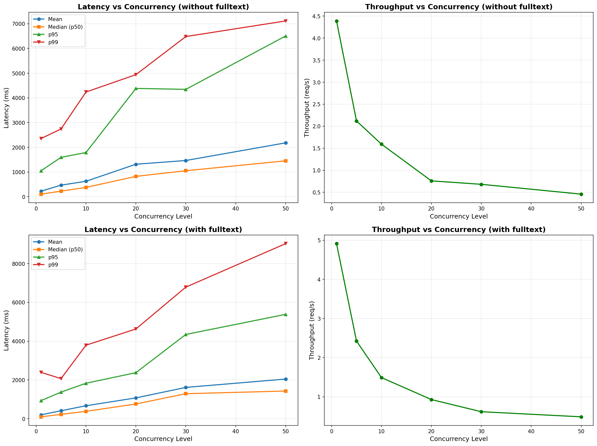
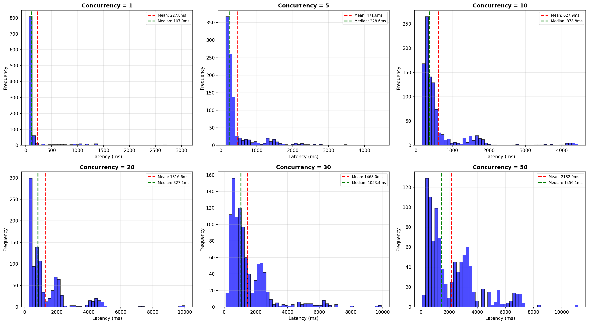

# FAISS Passage Retrieval System

Billion-scale passage retrieval system using FAISS for fast semantic search over 1.6B passages.

## Overview

This project provides:
- **Document processing pipeline**: Convert documents to passages with byte-offset indexing
- **Embedding generation**: Multi-GPU embedding using facebook/contriever
- **FAISS indexing**: IVFPQ index for efficient billion-scale search
- **FastAPI service**: REST API for passage and document retrieval
- **Load testing**: Comprehensive benchmarking tools

## Quick Start

### 1. Install Dependencies

```bash
# Create environment from export
conda env create -f environment.yml -p .conda
```

### 2. Start the API Service

**Local (CPU):**
```bash
python -m api.server
```

**Local (GPU):**
```bash
python -m api.server --use_gpu --workers 8
```

For 8 H200 I recommend using 16 workers.

**SLURM (Production):**
```bash
sbatch slurm_start_service.sh
# Check status: cat runtime/server_info_<job_id>.json
```

### 3. Test the Service

```bash
curl -X POST http://localhost:8000/search \
  -H "Content-Type: application/json" \
  -d '{
    "query": "What is machine learning?",
    "k": 10,
    "return_fulltext": false
  }'
```

## Project Structure

```
faster_index/
├── scripts/                          # Data processing pipeline
│   ├── convert_parquets_to_jsonl.py  # Convert parquet to JSONL
│   ├── map_documents.py              # Create document mappings
│   ├── create_passages.py            # Chunk documents into passages
│   ├── 03_create_embeddings.py       # Generate embeddings (multi-GPU)
│   ├── create_faiss_index.py         # Build FAISS index
│   └── slurm_create_embeddings.sh    # SLURM script for embeddings
│
├── api/                              # FastAPI service
│   ├── server.py                     # Main API server
│   ├── search.py                     # Search logic and index loading
│   ├── utils.py                      # Document ranking utilities
│   ├── benchmark.py                  # Single-query benchmark (10 queries)
│   └── load_test.py                  # Load testing (1000+ requests)
│
├── slurm_start_service.sh            # SLURM script to start API service
├── environment.yml                   # Conda environment export
├── API_README.md                     # Detailed API documentation
└── README.md                         # This file
```

## Key Files

### API Service
- **`api/server.py`**: FastAPI server with `/search`, `/get_document`, `/health`, `/stats` endpoints
- **`api/search.py`**: Core search functions (embedding, passage/document retrieval)
- **`API_README.md`**: Complete API documentation with examples

### Data Pipeline
- **`scripts/create_passages.py`**: Chunks documents into 128-token passages
- **`scripts/03_create_embeddings.py`**: Generates embeddings using DataParallel
- **`scripts/create_faiss_index.py`**: Creates IVFPQ index (ncentroids=4096, nprobe=2048)

### Testing
- **`api/benchmark.py`**: Tests 10 queries, detailed timing breakdown
- **`api/load_test.py`**: Stress test with configurable concurrency (1-50 concurrent requests)

## System Requirements

**For API Service (16 workers):**
- 8 GPUs
- 600GB RAM
- 108GB VRAM per GPU

**For API Service (8 workers):**
- 8 GPUs
- 303GB RAM
- 54GB VRAM per GPU

## Data Processing Pipeline

```bash
# 1. Convert parquet to JSONL
python scripts/convert_parquets_to_jsonl.py

# 2. Create document mappings
python scripts/map_documents.py

# 3. Create passages
python scripts/create_passages.py

# 4. Generate embeddings (SLURM)
sbatch scripts/slurm_create_embeddings.sh

# 5. Build FAISS index
python scripts/create_faiss_index.py --use_gpu
```

## API Endpoints

- **POST `/search`**: Search for passages (with optional document retrieval)
- **POST `/get_document`**: Get full document by ID
- **GET `/health`**: Health check
- **GET `/stats`**: Index statistics

See **[API_README.md](API_README.md)** for detailed endpoint documentation.

## Running Load Tests

```bash
# Test with default settings (1000 requests, concurrency 1-50)
python api/load_test.py --url http://localhost:8000/search

# Custom configuration
python api/load_test.py \
  --url http://your-server:8000/search \
  --num_requests 2000 \
  --concurrency_levels "1,10,25,50" \
  --k_values "5,10,20"
```

Generates:
- JSON results with latency metrics (min, max, mean, p50, p95, p99)
- Performance plots (latency vs concurrency, throughput)
- Latency distribution histograms

## Performance

**GPU (8 H200 GPUs, 16 workers):**
- Search: ~10-50ms per query
- Startup: ~30-60 seconds (loading index + model)
- Throughput: Up to 50+ req/s at concurrency=50

**Index Stats:**
- Total passages: 1.6B
- Total documents: 145M
- Index type: IVFPQ (4096 clusters, 16 subquantizers, 8-bit codes)

### Load Test Results (16 workers, with and without fulltext)

**Latency and Throughput:**



**Latency Distributions:**



Key metrics from load testing:
- **p95 latency**: ~0.5-1 sec (depending on concurrency)
- **p99 latency**: ~1-2 sec (depending on concurrency)
- **Throughput**: Scales well with concurrency (1→50 concurrent requests)
- **Success rate**: 100% across all concurrency levels

## SLURM Integration

Start service and track status:
```bash
# Submit job
sbatch slurm_start_service.sh

# Monitor status
cat runtime/server_info_<job_id>.json

# Use in scripts
python your_script.py --job_id <job_id>
```

The server info file contains:
- Host and port
- Full URL
- Status (`loading` or `ready`)
- Timestamps

See **[API_README.md](API_README.md#running-with-slurm)** for programmatic access examples.

## License

Internal research project.
